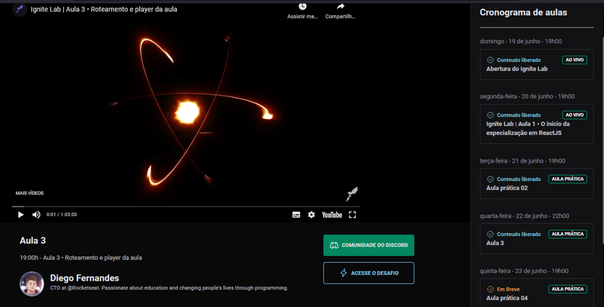

# Plataforma de evento - Ignite Lab (Community)

### Aplicação desenvoldiva durante o evento Ignite Lab, realizado pela Rocketseat. 🚀 🚀 🚀

## Tecnologias utilizadas

- React
- GraphQL
- Apollo Client
- TailwindCSS

## Hospedagem

- Vercel 👉 Link [ignite-lab-react](https://vercel.com/edineiandrade/ignite-lab-react)

### Layout



# Links das Bibliotecas Utilizadas

### React: https://pt-br.reactjs.org/docs/getting-started.html

### Vite: https://vitejs.dev/guide/

### Instalação (utilizando vite):

```bash
npm create vite@latest my-react-app -- --template react
```

### Apos instalar o node module:

```js
npm install
```

### Tailwind CSS: https://tailwindcss.com/docs/installation

### Instalação

```bash
npm install -D tailwindcss
npx tailwindcss init
```

### Apollo Client: https://www.apollographql.com/docs/react/

### Instalação

```bash
npm install @apollo/client graphql
```

### Phosphoricons: https://phosphoricons.com/

### Instalação

```bash
npm install --save phosphor-react
```

### Date-fns: https://date-fns.org/docs/Getting-Started#installation

### Instalação

```bash
npm install date-fns --save
```

### React-youtube: https://www.npmjs.com/package/react-youtube

### Instalação

```bash
npm install react-youtube
```
